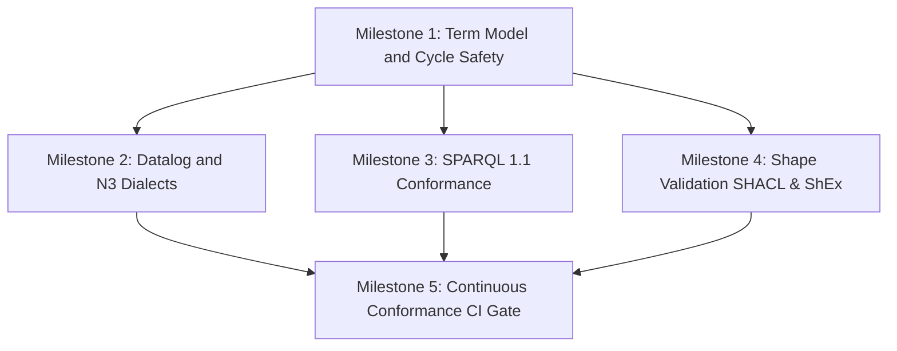

# plan.md — Project Plan for roxi RDF Engine Enhancements

This document tracks the milestones and execution plan for the roxi RDF engine enhancements.

## Milestones and Dependencies

### Milestone Breakdown

1. **Milestone 1: Term Model and Cycle Safety**
   - **Scope**: TICKET-001 (Extend VarOrTerm/TermImpl with Literals/BlankNodes), TICKET-002 (Production cycle guard), TICKET-003 (csprite cycle guards).
   - **Target**: Implement a type-safe term model with full interning roundtrip for IRI, typed/langtagged literals, and blank nodes. Add cycle guards to backward-chaining query paths and csprite rule composition.
   - **Verification**: Baselines pass + unit/integration tests for roundtripping literals/blank nodes and cycle-safety.

2. **Milestone 2: Datalog and N3 Dialects**
   - **Scope**: TICKET-004 (Datalog engine with stratification, safety check, negation, and aggregates), TICKET-005 (N3 full grammar parsing and reasoning).
   - **Target**: Add stratified evaluation and rule safety validation to forward-chaining reasoner. Support N3 lists, quoted graphs, quantifiers, built-ins, and multi-triple heads.
   - **Verification**: Custom Datalog conformance suite + Eye/N3 community test corpus.

3. **Milestone 3: SPARQL 1.1 Conformance**
   - **Scope**: TICKET-006 (SPARQL 1.1 W3C conformance suite integration and gap closure).
   - **Target**: W3C sparql11-test-suite integration, initial gap run (sizing spike), and feature gap closure.
   - **Verification**: 100% pass on W3C conformance suite.

4. **Milestone 5 (represented here as Milestone 4): Shape Validation (SHACL & ShEx)**
   - **Scope**: TICKET-007 (oxrdf adapter layer), TICKET-008 (SHACL validation via shacl_validation), TICKET-009 (ShEx validation via shex_validation).
   - **Target**: Implement adapter layer, parse shapes, execute shape validation, translate results back to roxi triples.
   - **Verification**: W3C data-shapes SHACL suite + shexTest suite.

5. **Milestone 5: Continuous Conformance CI Gate**
   - **Scope**: TICKET-010 (CI workflow, conformancestatus.md report).
   - **Target**: Setup GitHub Action running all 5 conformance suites.
   - **Verification**: Green run in CI, unified conformance status doc.
