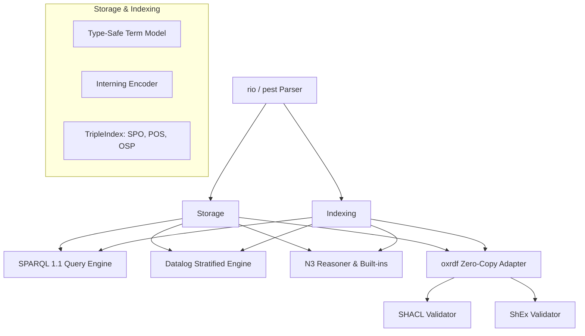

# Introduction

## Overview of the Roxi RDF Engine

Roxi is an embedded, lightweight, and extremely high-performance RDF database and reasoning engine written natively in Rust. Designed to support modern semantic architectures, Roxi stands out by compiling cleanly to WebAssembly (`wasm32-unknown-unknown`), enabling client-side semantic applications, reactive browser-based graph reasoning, and offline-first semantic web clients. At the same time, it compiles to high-performance native binaries for server deployments, streaming pipelines, and desktop applications.

The central design philosophy of Roxi is **dialect unification**. In typical semantic architectures, developers are forced to string together a pipeline of disparate tools to parse files, perform inference, run queries, and validate structures. For instance, a typical enterprise setup might require Apache Jena for storage, EYE for Notation3 rules reasoning, a custom Datalog processor, and a separate SHACL validator. This disjointed design suffers from massive serialization costs, distinct memory layouts, and strict execution boundaries (such as validating shapes only before or after reasoning, missing transient rule violations).

Roxi eliminates these barriers by running five semantic dialects directly on top of a single, highly optimized memory substrate:

| Dialect | Specification Basis | Primary Purpose in Roxi |
| :--- | :--- | :--- |
| **SPARQL 1.1** | W3C Recommendation | Declarative query execution and graph updates. |
| **SHACL** | W3C Recommendation | Shape-based data validation and core constraints. |
| **ShEx** | W3C Community Group | Shape Expressions validation and recursive validation. |
| **Datalog** | Logic Programming Standard | Stratified negation, recursive rules, and aggregates. |
| **Notation3 (N3)** | W3C Team Submission | Expressive rules, quoted graphs, lists, built-ins, and quantifiers. |

---

## Architectural Substrate

At the core of Roxi is a unified, memory-efficient index structure called the `TripleIndex`. This index is supported by a global, tag-aware interning `Encoder` that maps complex RDF terms (IRIs, language-tagged strings, datatypes, blank nodes, and nested triple terms) to simple, machine-word-sized integers (`usize`). 

All five evaluators (SPARQL, SHACL, ShEx, Datalog, and N3) share this single term representation. When you parse a file, load rules, run a query, or validate a shape, the engine executes comparison and index lookups purely as integer matches. Only at the boundary of serialization or external library mapping are these integers decoded back into strings.

This book serves as the comprehensive manual for developing with Roxi. It covers installation, basic and advanced query pipelines, detailed implementation references for each dialect, and our continuous conformance validation infrastructure.
