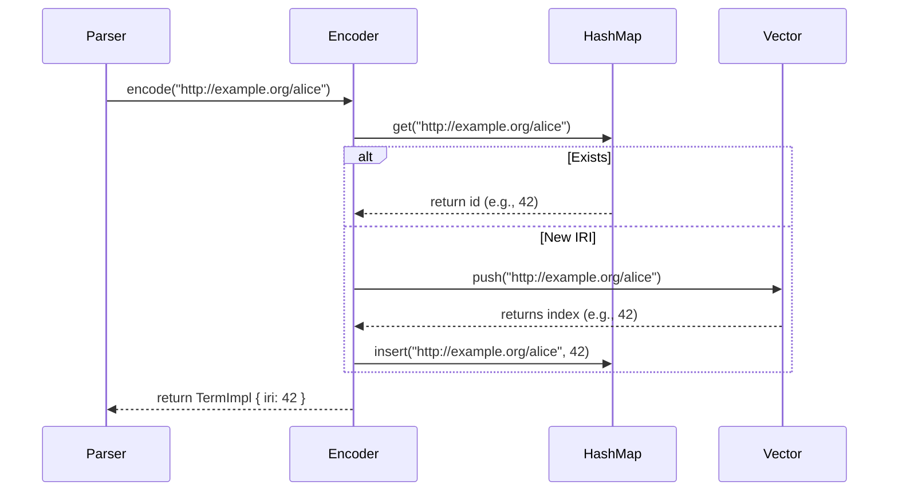

# Iri & Encoder

## Resource String Interning

The `Encoder` struct in [lib/src/encoding.rs](file:///Users/sac/roxi/lib/src/encoding.rs) manages string interning. Interning is the process of storing a string exactly once in memory and referring to it via a small integer identifier.

Here is the structural implementation of the `Encoder`:

```rust
pub struct Encoder {
    iri_to_id: HashMap<String, usize>,
    id_to_iri: Vec<String>,
}
```

---

## Encoding Workflow

When the parser extracts a resource (like an IRI), it calls `Encoder::encode`:



---

## Benefits of Interning

* **Memory Reduction**: Long namespace strings (such as `http://www.w3.org/1999/02/22-rdf-syntax-ns#`) are stored exactly once.
* **Integer Indexing**: Roxi's `Triple` struct represents a statement using machine-sized integers:
  ```rust
  pub struct Triple {
      pub s: VarOrTerm,
      pub p: VarOrTerm,
      pub o: VarOrTerm,
      pub g: Option<VarOrTerm>,
  }
  ```
  Comparing two triples is reduced to checking equality of three integers, which is executed in a single CPU cycle.
